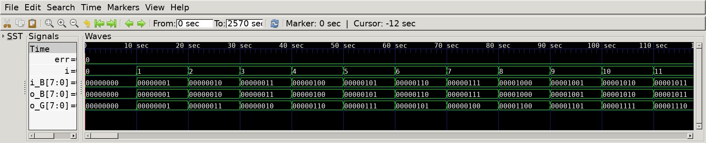
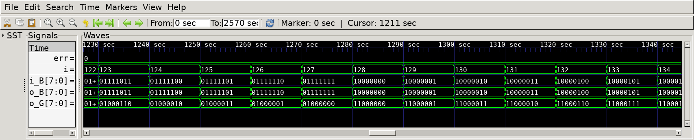
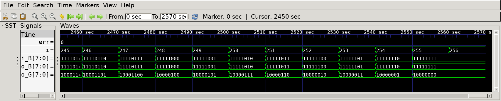

# Gray Code Converter
## Operation Principle
- Gray Code : Consecutive numbers differ in only one bit poistion.

- Bin -> Gray
    - G[N-1]    = B[N-1]
    - G[i]      = B[i+1] ^ B[i]

- Gray -> Bin
    - B[N-1]    = G[N-1]
    - B[i]      = G[i] ^ B[i+1]

## Verilog Code
### DUT
#### Bin -> Gray
```Verilog
module bin_to_gray
#(  
    parameter   N   = 32
)
(   
    output      [N-1:0] o_G,
    input       [N-1:0] i_B
);
    genvar i;
    generate 
        for (i=0; i<N-1; i=i+1) begin
            assign o_G[i]   = i_B[i] ^ i_B[i+1];
        end
    endgenerate

    assign o_G[N-1] = i_B[N-1];

endmodule
```
#### Gray -> Bin

```Verilog
module gray_to_bin
#(  
    parameter   N   = 32
)
(   
    output      [N-1:0] o_B,
    input       [N-1:0] i_G
);
    genvar i;
    generate 
        for (i=0; i<N-1; i=i+1) begin
            assign o_B[i]   = i_G[i] ^ o_B[i+1];
        end
    endgenerate
    
    assign o_B[N-1] = i_G[N-1];

endmodule
```

### Testbench
```Verilog
[...]
// --------------------------------------------------
//  Test Stimulus
// --------------------------------------------------
    integer     i, j;
    initial begin
        init();
        for (i=0; i<`SIMCYCLE; i++) begin
            i_B = i;    
            #(1000/`CLKFREQ);
            if (i_B != o_B) begin
                err = err + 1;
            end
        end
        #(1000/`CLKFREQ);
        if (err == 0) begin
            $display("Sim Completed : No Error Occurred.");
        end
        $finish;
    end
[...]
```

## Simulation Result

- @ 0sec~
    - Binary Input: 00000000, 00000001, 00000010, 00000011, 00000100, ...
    - Gray Code Output: 00000000, 00000001, 00000011, 00000010, 00000110
    - Binary Ouput: 00000000, 00000001, 00000010, 00000011, 00000100, ...



- @ 1280sec
    - MSBs of all signals correctly transitioned (0->1) : both converters work as expected.



- @ 2560sec
    - Simulation for all input cases completed with 'err=0'.
