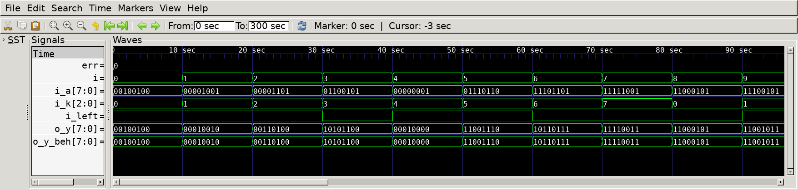

# Barrel Shifter
## Operation Principle
- Barrel Shifter rotates the bits of a binary number by a specified amount 'k'.
- If the input signal 'left' is on, it rotates left; if off, rotates right.

## Verilog Code
### DUT
```Verilog
module barrel_shifter
#(
    parameter   BW_DATA         = 8,
    parameter   BW_CTRL         = 3
)
(   
    output      [BW_DATA-1:0]           o_y,
    input       [BW_DATA-1:0]           i_a,
    input       [BW_CTRL-1:0]           i_k,    // rotate amount
    input                               i_left  // rotate direction (1:left , 0:right)
);

    wire        [BW_DATA-1:0]           stage[BW_CTRL:0];
    
    genvar i, j;
    generate 
        for (i=0; i<=BW_CTRL; i=i+1) begin
            for (j=0; j<BW_DATA; j=j+1) begin
                mux2 
                u_mux2(
                    .o_data         (stage[i][j]                                                                    ),
                    .i_data0        (i==0       ? i_a[j]               : stage[i-1][j]                              ),
                    .i_data1        (i==0       ? i_a[(j+1) % BW_DATA] : stage[i-1][(j+2**(BW_CTRL-i)) % BW_DATA]   ),
                    .i_sel          (i==0       ? i_left               : i_left^i_k[BW_CTRL-i]                      )
                );
            end
        end
    endgenerate
    
    assign o_y = stage[BW_CTRL];
endmodule
```

### Behavioral Model (For Simulation)
```Verilog
module barrel_shifter_beh
#(  
    parameter   BW_DATA         = 8,
    parameter   BW_CTRL         = 3
)
(   
    output      [BW_DATA-1:0]           o_y,
    input       [BW_DATA-1:0]           i_a,
    input       [BW_CTRL-1:0]           i_k,    // rotate amount
    input                               i_left  // rotate direction (1:left , 0:right)
);
    assign o_y = i_left ?   (i_a << i_k) | (i_a >> (BW_DATA-i_k)) :
                            (i_a >> i_k) | (i_a << (BW_DATA-i_k));
endmodule
```

### Testbench
```Verilog
[...]
// --------------------------------------------------
//  Test Stimulus
// --------------------------------------------------
    integer i, j;
    initial begin
        init();
        for (i = 0; i < `SIMCYCLE; i=i+1) begin
            i_a         = $urandom;
            i_k         = i % `BW_DATA;
            i_left      = $urandom;
            #(1000/`CLKFREQ);
        end
        if (err==0) begin
            $display("No error occurred.");
        end
        $finish;
    end

    always #(1000/`CLKFREQ) begin
        if (o_y != o_y_beh) begin
            $display("ERROR at time %t", $time);
            err=err+1;
        end
    end
[...]
```

## Simulation Result

- @ 0sec : k=0, left=1
    - input '00100100' left-rotated by 0 => output remains unchanged

- @ 20sec : k=2, left=1
    - input '00001101' left-rotated by 2 => '00110100'

- @ 30sec : k=3, left=0
    - input '01100101' right-rotated by 3 => '10101100'
