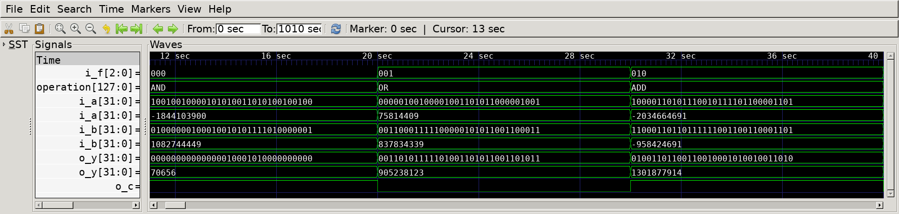
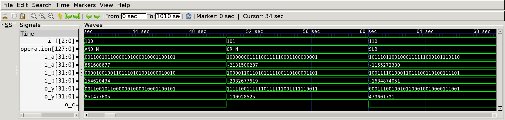
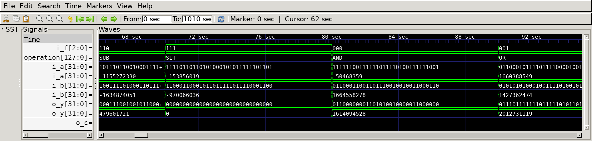
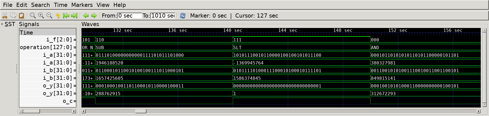
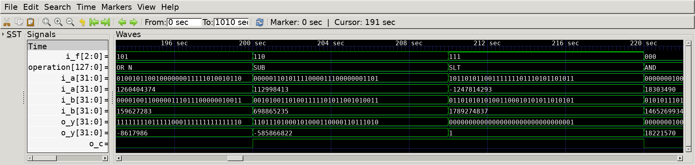

# ALU
## Operation Principle
- An ALU operates as follows based on the given table:
    - F = 000 : A & B
    - F = 001 : A | B
    - F = 010 : A + B
    - F = 011 : not used
    - F = 100 : A & ~B
    - F = 101 : A | ~B
    - F = 110 : A - B
    - F = 111 : SLT

## Verilog Code
### DUT
```Verilog
module alu
#(  
    parameter   N       = 32
)
(   
    output reg signed   [N-1:0]     o_y,
    output                          o_c,
//  output                          o_ovf,
    input signed        [N-1:0]     i_a,
    input signed        [N-1:0]     i_b,
    input               [2:0]       i_f
);

    wire signed         [N-1:0]     sum;
//  wire                            ovf_add =   (i_f == 3'b010) &&
//                                              ((~i_a[N-1] && ~i_b[N-1] && sum[N-1]) || (i_a[N-1] && i_b[N-1] && ~sum[N-1]));
//  wire                            ovf_sub =   (i_f == 3'b110) && 
//                                              ((~i_a[N-1] && i_b[N-1] && sum[N-1]) || (i_a[N-1] && ~i_b[N-1] && ~sum[N-1]));
//
//  assign o_ovf = ovf_add || ovf_sub;  
    assign {o_c, sum} = i_f[2] ? i_a-i_b : i_a+i_b;

    always @(*) begin
        case (i_f)
            3'b000  : o_y = i_a & i_b;
            3'b001  : o_y = i_a | i_b;
            3'b010  : o_y = sum;
            3'b100  : o_y = i_a & ~i_b;
            3'b101  : o_y = i_a | ~i_b;
            3'b110  : o_y = sum;
            3'b111  : o_y = i_a < i_b;
            default : o_y = 'd0;
        endcase
    end
endmodule
```

### Testbench
```Verilog
[...]
    task perform_operation;
        input   [2:0]       ti_f;
        input   [`N-1:0]    ti_a;
        input   [`N-1:0]    ti_b;
        begin
            #(1000/`CLKFREQ);
            i_a = ti_a;
            i_b = ti_b;
            i_f = ti_f;
        end
    endtask

// --------------------------------------------------
//  Test Stimulus
// --------------------------------------------------
    integer i, fn;

    initial begin
        init();
        i   = 0;
        fn  = 0;
        while(i < `SIMCYCLE) begin
            if (fn%8 != 3) begin
                perform_operation(
                    fn,
                    $urandom,
                    $urandom
                );  
                i=i+1;
            end
            fn=fn+1;
        end
        #(1000/`CLKFREQ);
        $finish;
    end
    always @(*) begin
        case (i_f)
            3'b000  : operation = "AND";
            3'b001  : operation = "OR";
            3'b010  : operation = "ADD";
            3'b100  : operation = "AND_N";
            3'b101  : operation = "OR_N";
            3'b110  : operation = "SUB";
            3'b111  : operation = "SLT";
            default : operation = "NOT_USED";
        endcase
    end
[...]
```

## Simulation Result

- @ 10sec : i_f = 000
    - AND Operation
- @ 20sec : i_f = 001
    - OR Operation
- @ 30sec : i_f = 010
    - ADD Operation
        - a = 1000_0110_ ...
        - b = 1100_0110_ ...
        - a+b = 0100_1101_ ..., cout = 1


- @ 40sec : i_f = 100
    - AND_NOT Operation
- @ 50sec : i_f = 101
    - OR_NOT Operation
- @ 60sec : i_f = 110
    - SUB Operation
        - a = 1011_1011_ ...
        - b = 1001_1110_ ...
        - a-b = 0001_1100_ ..., cout = 0


- @ 70sec : i_f = 111
    - SLT Operation
        - a = 1111_0110_ ... (-153856019)
        - b = 1100_0110_ ... (-970066036)
        - a<b = false


- @ 140sec : i_f = 111
    - SLT Operation
        - a = 1010_1110_ ... (-1369945764)
        - b = 0101_1110_ ... ( 1586374845)
        - a<b = true


- @ 200sec : i_f = 110
    - SUB Operation
        - a = 0000_0110_ ...
        - b = 0010_1001_ ...
        - a-b = 1101_1101_ ..., cout = 1
