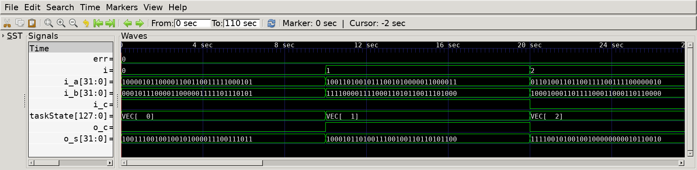
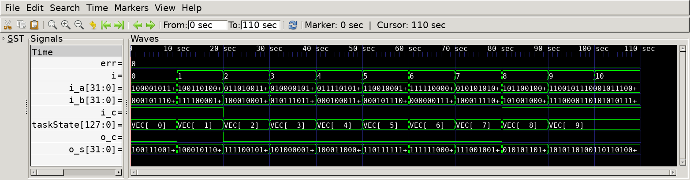

# Carry Lookahaed Adder
## Operation Principle
    P[i] = A[i] ^ B[i];
    G[i] = A[i] & B[i];
    C[i] =  
## Verilog Code
### DUT
```Verilog
module adder_cla
#(  
    parameter   BW_DATA         = 32
)
(   
    output      [BW_DATA-1:0]   o_s,
    output                      o_c,
    input       [BW_DATA-1:0]   i_a,
    input       [BW_DATA-1:0]   i_b,
    input                       i_c
);
    wire        [BW_DATA/4:1]   carry; // carry[i] : cout of 'i-th' 4b CLA (cout of each '4i-th' bit)

    genvar i;
    generate 
        for (i=0; i<BW_DATA/4; i=i+1) begin
            cla_4b 
            u_cla_4b(
                .o_s    (o_s[i*4 +: 4]         ),
                .o_c    (carry[i+1]            ),
                .i_a    (i_a[i*4 +: 4]         ),
                .i_b    (i_b[i*4 +: 4]         ),
                .i_c    (i==0 ? i_c : carry[i] )
            );
        end
    endgenerate

    assign o_c = carry[BW_DATA/4];
endmodule
```

### 4-bit CLA
```Verilog
module cla_4b
(   
    output      [3:0]   o_s,
    output              o_c,
    input       [3:0]   i_a,
    input       [3:0]   i_b,
    input               i_c
);
    wire        [3:1]   C;
    wire        [3:0]   P       = i_a ^ i_b;
    wire        [3:0]   G       = i_a & i_b;
    
    wire                P_3_0   = &P;
    wire                G_3_0   = G[3] | (P[3] & (G[2] | (P[2] & (G[1] | (P[1] & G[0])))));

    assign C[1] = G[0] || (P[0] && i_c);  
    assign C[2] = G[1] || (P[1] && C[1]);
    assign C[3] = G[2] || (P[2] && C[2]);

    assign o_s  = P ^ {C, i_c};
    assign o_c  = G_3_0 || (P_3_0 & i_c);
    
endmodule
```

### Testbench
```Verilog
[...]
// --------------------------------------------------
//  Test Stimulus
// --------------------------------------------------
    integer     i, j;
    initial begin
        init();
        for (i=0; i<`SIMCYCLE; i++) begin
            vecInsert(i);
            vecVerify(i);
        end
        #(1000/`CLKFREQ);
        if (err==0) begin
            $display("No error occurred.");
        end
        $finish;
    end
[...]
```

## Simulation Result

- @ 0sec
	- a = 32'b1000_0101_ ...
	- b = 32'b0001_0111_ ...
	- a+b = 32'b1001_1100_ ... --> correct
	- c = 0 --> correct

- @ 10sec
    - a   = 32'b1001_1010_ ...
    - b   = 32'b1111_0000_ ...
    - a+b = 32'b1000_1011_ ... --> correct
    - c   = 1 --> correct


-@ 100sec
	- Sim completed with 'err=0'.
