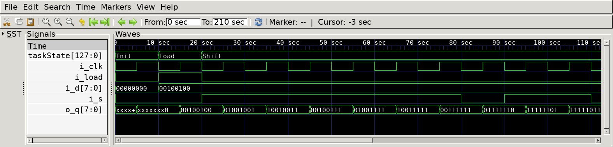

# Shift Register with Parallel Load
## Operation Principle
- When Load = 1, acts as a normal N-bit register
- When Load = 0, acts as a shift Register

## Verilog Code
### DUT
```Verilog
module shift_register
#(	
	parameter	BW_DATA			= 32
)
(	
	output reg	[BW_DATA-1:0]	o_q,
	input		[BW_DATA-1:0]	i_d,
	input						i_load,
	input						i_clk,
	input						i_s
);
	always @(posedge i_clk) begin
		if (i_load)	begin
			o_q <= i_d;
		end else begin
			o_q <= {o_q[BW_DATA-2:0], i_s};
		end
	end

endmodule
```

### Testbench
```Verilog
[...]
	task p_load;
		input [`BW_DATA-1:0]	ti_data;
		begin
			@(negedge i_clk);
			taskState		= "Load";
			i_d				= ti_data;
			i_load			= 1;
		end
	endtask

	task shift;
		input	ti_data;
		begin
			@(negedge i_clk);
			taskState		= "Shift";
			i_load			= 0;
			i_s				= ti_data;
		end
	endtask

	
// --------------------------------------------------
//	Test Stimulus
// --------------------------------------------------
	integer		i, j;
	initial begin
		init();
		p_load($urandom_range(0, 2**`BW_DATA-1));
		#(1000/`CLKFREQ);
		for (i=0; i<`SIMCYCLE; i=i+1) begin
			shift($urandom);
		end
		$finish;
	end
[...]
```

## Simulation Result

-@ 15sec : load=1, d=8'b00100100
- parallel input '00100100' is parallely loaded. 

-@ 25sec : load=0, s=1
- '00100100' is right-shifted with 's=1' -> '01001001'

-@ 85sec : load=0, s=0
- '00111111' is right-shifted with 's=0' -> '01111110'
