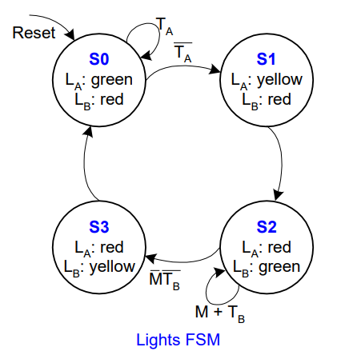
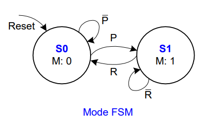
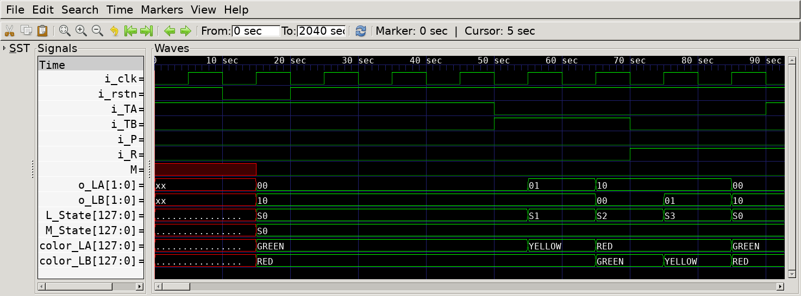
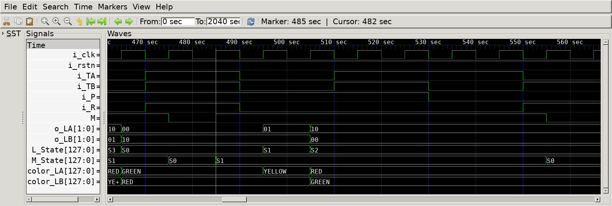
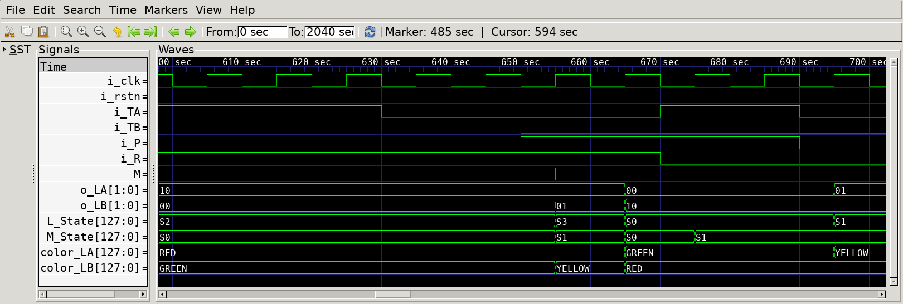

# FSM - Traffic Light Controller
## Operation Principle

- Traffic sensors: TA, TB (TRUE when there’s traffic)
- Lights: LA, LB (Green or Yellow or Red)
    

- When P = 1
    - enter Parade Mode & Bravado Blvd light stays green
- When R = 1
    - leave Parade Mode

## Verilog Code
### DUT
```Verilog
module fsm_traffic_light
(   
    output reg  [1:0]   o_LA,
    output reg  [1:0]   o_LB,
    input               i_TA,
    input               i_TB,
    input               i_P,
    input               i_R,
    input               i_clk,
    input               i_rstn
);

    localparam  S0      = 2'd0;
    localparam  S1      = 2'd1;
    localparam  S2      = 2'd2;
    localparam  S3      = 2'd3;

    localparam  GREEN   = 2'd0;
    localparam  YELLOW  = 2'd1;
    localparam  RED     = 2'd2;
    
    reg [2:0]   c_state_L, n_state_L;
    reg [1:0]   c_state_M, n_state_M;

    wire    M   = c_state_M == S1;

    always @(posedge i_clk) begin
        if(!i_rstn) begin
            c_state_L   <= S0;
        end else begin
            c_state_L   <= n_state_L;   
        end
    end
    
    always @(*) begin
        case (c_state_L)
            S0  : n_state_L = ~i_TA         ? S1 : S0;
            S1  : n_state_L = S2;
            S2  : n_state_L = ~M && ~i_TB   ? S3 : S2;
            S3  : n_state_L = S0;
        endcase
    end

    always @(posedge i_clk) begin
        if(!i_rstn) begin
            c_state_M   <= S0;  
        end else begin
            c_state_M   <= n_state_M;   
        end
    end
    
    always @(*) begin
        case (c_state_M)
            S0  : n_state_M = i_P ? S1 : S0;
            S1  : n_state_M = i_R ? S0 : S1;
        endcase
    end

    always @(*) begin
        case (c_state_L)
            S0 : begin
                o_LA = GREEN;
                o_LB = RED;
            end
            S1 : begin
                o_LA = YELLOW;
                o_LB = RED;
            end
            S2 : begin
                o_LA = RED;
                o_LB = GREEN;
            end
            S3 : begin
                o_LA = RED;
                o_LB = YELLOW;
            end
        endcase
    end
endmodule
```

### Testbench
```Verilog
[...]
// --------------------------------------------------
//  Test Stimulus
// --------------------------------------------------
    integer     i;
    initial begin
        init();
        #(1000/`CLKFREQ);
        resetNCycle(1);
        #(1000/`CLKFREQ);
        for (i=0; i<`SIMCYCLE; i=i+1) begin
            #(1000/`CLKFREQ);
            {i_TA, i_TB, i_P, i_R} = $urandom;
        end
        #(1000/`CLKFREQ);
        $finish;
    end
    
    reg     [4*32-1:0]  L_State, M_State;
    reg     [4*32-1:0]  color_LA, color_LB;

    always @(*) begin
        case (u_fsm_traffic_light.c_state_L)
            2'd0    : L_State = "S0";
            2'd1    : L_State = "S1";
            2'd2    : L_State = "S2";
            2'd3    : L_State = "S3";
        endcase
    end

    always @(*) begin
        case (u_fsm_traffic_light.c_state_M)
            2'd0    : M_State = "S0";
            2'd1    : M_State = "S1";
        endcase
    end
    
    always @(*) begin
        case (o_LA)
            2'd0    : color_LA = "GREEN";
            2'd1    : color_LA = "YELLOW";
            2'd2    : color_LA = "RED";
        endcase
    end

    always @(*) begin
        case (o_LB)
            2'd0    : color_LB = "GREEN";
            2'd1    : color_LB = "YELLOW";
            2'd2    : color_LB = "RED";
        endcase
    end
[...]
```

## Simulation Result

- @ 15sec : rstn = 0
    - L_state == M_state == S0
    - LA = GREEN 
    - LB = RED

- @ 55sec: TA = 0
    - L_state : S0 -> S1
    - LA = GREEN -> YELLOW
    - LB = RED
    
- @ 65sec
    - L_state : S1 -> S2
    - LA = YELLOW -> RED
    - LB = RED -> GREEN

- @ 75sec : TB = 0, M = 0
    - L_state : S2 -> S3
    - LA = RED
    - LB = GREEN -> YELLOW

- @ 85sec
    - L_state : S3 -> S0
    - LA = RED -> GREEN
    - LB = YELLOW -> RED


- @ 485sec : P = 1
    - M_state : S0 -> S1
    - M = 0 -> 1

- @ 495sec : p = 1
    - M_state : S0 -> s1
    - M = 0 -> 1
    
- @ 535sec : TB = 0, M = 1
    - L_state : S2 (remains unchanged)

- @ 555sec : R = 1
    - M_state : S1 -> S0
    - M = 1 -> 0


- @ 655sec : TB = 0, M = 0
    - L_state : S2 -> S3
    - LA = RED
    - LB = GREEN -> YELLOW
