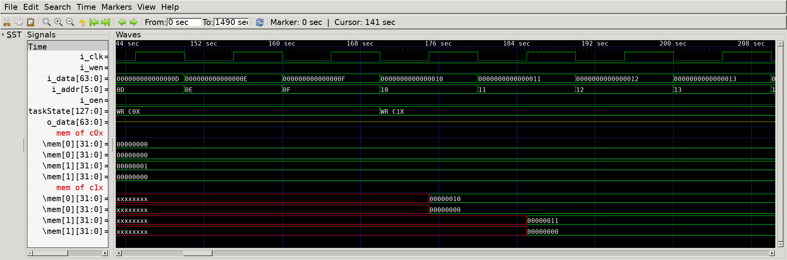

# SRAM Extension
## Operation Principle
- Assume Synchronous SRAM
    - read and write operations are synchronized to clock edge
    - wen == 1 : mem[i_addr] <= i_data
    - oen == 1 : o_data <= mem[i_addr]
    - wen == cen == 0 : no operation

- Assume each single chip supports :
    - 4-bit address space
    - 32-bit data width

- To achieve:
    - 6-bit address width : 4 single chips needed
    - 64-bit data width : x2 single chips needed

- total of 8 single chips are required.
        
## Verilog Code
### DUT
```Verilog
module sram_extension
(
    output      [63:0]  o_data,
    input       [63:0]  i_data,
    input       [5:0]   i_addr,
    input               i_wen,
    input               i_oen,
    input               i_clk
);

    wire        [31:0]  w_o_data[1:0];  
    wire        [31:0]  w_i_data[1:0];      // i/o data is divided into 2 parts
    wire        [3:0]   cen;                // chip select

    assign o_data                       = {w_o_data[1], w_o_data[0]};
    assign {w_i_data[1], w_i_data[0]}   = i_data;
    
    assign cen = 4'b0001 << i_addr[5:4];    // 2 out of 8 chips are activated for each case
    
    genvar i, j;
    generate 
        for (i=0; i<4; i=i+1) begin         // i==0 : lowest mem addresses, i==3 : highest mem addresses
            for (j=0; j<2; j=j+1) begin     // j==0 : lower 32-bit data, j==1 : upper 32-bit data
                spsram
                #(
                    .BW_DATA        (32             ),
                    .BW_ADDR        (4              )
                )
                u_spsram(
                    .o_data         (w_o_data[j]    ),
                    .i_data         (w_i_data[j]    ),
                    .i_addr         (i_addr[3:0]    ),
                    .i_wen          (i_wen          ),
                    .i_cen          (cen[i]         ),
                    .i_oen          (i_oen          ),
                    .i_clk          (i_clk          )
                );
            end
        end
    endgenerate
endmodule
```

### Testbench
```Verilog
[...]
    task memWR;
        input [63:0]    ti_data;
        input [5:0]     ti_addr;
        begin
            @(negedge i_clk) begin
                i_data      = ti_data;
                i_addr      = ti_addr;
                i_wen       = 1;
                i_oen       = 0;
            end
        end
    endtask
    
    task memRD;
        input   [5:0]   ti_addr;
        begin
            @(negedge i_clk) begin
                i_addr      = ti_addr;
                i_wen       = 0;
                i_oen       = 1;
            end
        end
    endtask

// --------------------------------------------------
//  Test Stimulus
// --------------------------------------------------
    integer     i, j;
    initial begin
        init();
        #(1000/`CLKFREQ);
        for (i=0; i<`SIMCYCLE; i=i+1) begin
            memWR(i,i);
        end
        for (i=0; i<`SIMCYCLE; i=i+1) begin
            memRD(i);
        end
        #(1000/`CLKFREQ);
        i_oen = 0;
        for (i=0; i<20; i=i+1) begin
            #(1000/`CLKFREQ);
        end
        $finish;
    end
    
    always @(*) begin
        case ({i_wen, i_oen})
            2'b00 : taskState = "STANDBY";
            2'b01 : begin
                case (u_sram_extension.cen)
                    4'b0001 : taskState = "RD_C0X";
                    4'b0010 : taskState = "RD_C1X";
                    4'b0100 : taskState = "RD_C2X";
                    4'b1000 : taskState = "RD_C3X";
                endcase
            end
            2'b10 : begin
                case (u_sram_extension.cen)
                    4'b0001 : taskState = "WR_C0X";
                    4'b0010 : taskState = "WR_C1X";
                    4'b0100 : taskState = "WR_C2X";
                    4'b1000 : taskState = "WR_C3X";
                endcase
            end
            default : taskState = "NOT_ALLOWED";
        endcase
    end

// --------------------------------------------------
//  Dump VCD
// --------------------------------------------------
    reg [8*32-1:0]  vcd_file;
    initial begin
        if ($value$plusargs("vcd_file=%s", vcd_file)) begin
            $dumpfile(vcd_file);
            $dumpvars;
            for (j=0; j<16; j=j+1) begin
                $dumpvars(0, u_sram_extension.genblk1[0].genblk2[0].u_spsram.mem[j]); // mem of chip0l
                $dumpvars(0, u_sram_extension.genblk1[0].genblk2[1].u_spsram.mem[j]); // mem of chip0h
                $dumpvars(0, u_sram_extension.genblk1[1].genblk2[0].u_spsram.mem[j]); // mem of chip1l
                $dumpvars(0, u_sram_extension.genblk1[1].genblk2[1].u_spsram.mem[j]); // mem of chip1h
            end
        end else begin
            $dumpfile("sram_extension_tb.vcd");
            $dumpvars;
        end
    end
[...]
```

## Simulation Result

- @ 10sec~ : i_wen=1, i_oen=0, i_addr=00xxxx
    - Write mode
    - chip0x are activated, mem[00xxxx] <= 0 to 15


- @ 170sec~ : i_wen=1, i_oen=0, i_addr=01xxxx
    - Write mode
    - chip1x are activated, mem[01xxxx] <= 16 to 31


- @ 650sec~ : i_wen=0, i_oen=1, i_addr=00xxxx
    - Read mode
    - chip0x are activated, o_data = 0 to 15 (stored in mem[00xxxx])


- @ 650sec~ : i_wen=0, i_oen=1, i_addr=01xxxx
    - Read mode
    - chip1x are activated, o_data = 16 to 31 (stored in mem[01xxxx])


- @ 1290sec~ : i_wen=0, i_oen=0
    - Standby mode
